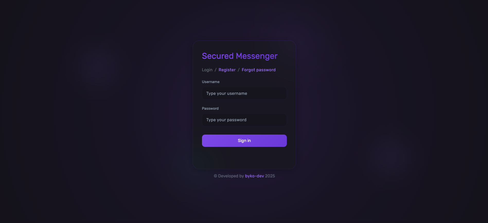
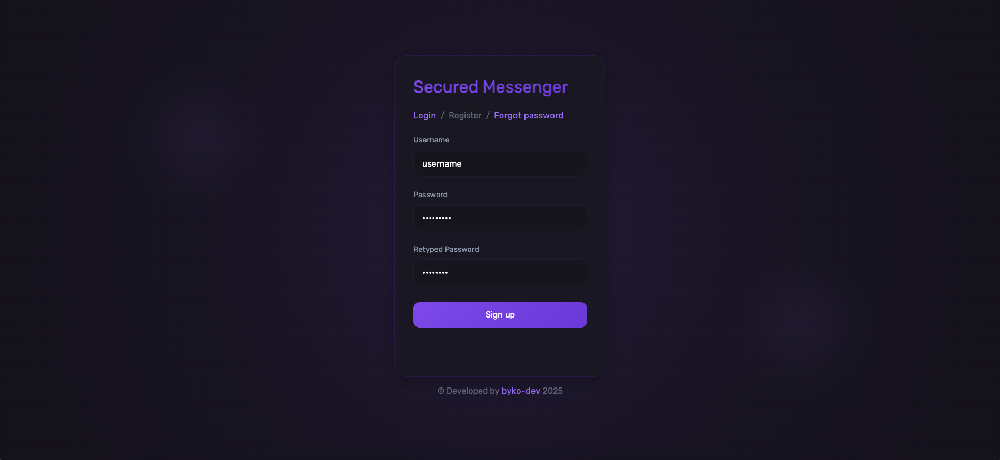
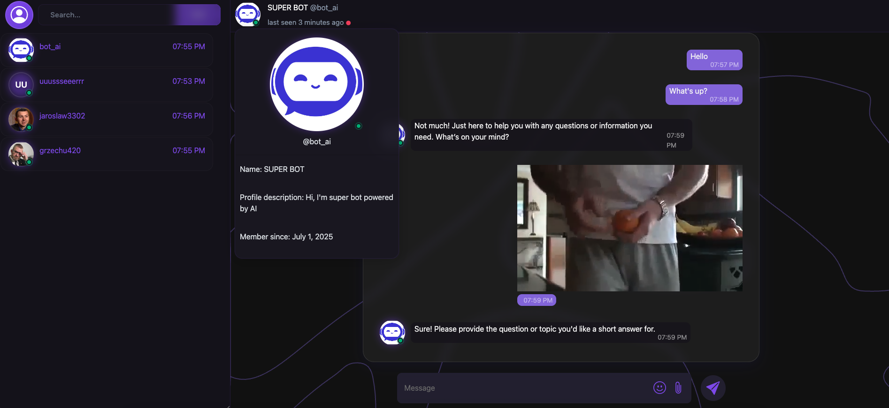

# Secure Messenger

Secure communicator that utilizes state-of-the-art encryption technologies such as RSA,
AES, MD5, BCRYPT to guarantee full privacy and security for transmitted information. The
project is based on programming tools such as Spring Boot with JWT, hibernate,
postgreSQL, WebSocket, Spring-Security and React with Redux and Sass ensuring its
performance and reliability.

### How to deploy application spring boot api:
1. Specify the appropriate variables in `application.properties` such as PostgreSQL database properties and secure keys in `md5.passphrase.salt`, `jwt.token.secrect` properties.
2. Check that everything is working properly using the integration tests in the folder `test`
3. Build the project using maven as `.war`
4. Configure docker on server
    - install docker and docker-compose 
      - `apt install docker.io`
      - `apt install docker-compose`
    - pull images
      - `docker pull tomcat`
      - `docker pull postgres`
    - create docker-compose.yml
      - `docker-compose up -d`
5. Set up spring boot application on tomcat server => /manager/html


### `docker-compose.yml` file
```
version: '3.5'
services:
  postgres:
    container_name: postgres
    image: postgres
    restart: always
    volumes:
      - path_to_change:/var/lib/postgresql/data
    ports:
      - 5432:5432
    environment:
      POSTGRES_USER: user
      POSTGRES_PASSWORD: password_to_change
      POSTGRES_DATABASE: database 
```

### Technologies used in backend part:
1. Spring boot 3.0
2. PostgreSQL, Hibernate
3. Spring Security, JWT authorization
4. Spring Validation
5. Spring WebSocket
6. Lombok
7. TestContainers
8. Aes256, RSA2048, BCrypt, MD5

### Technologies used in frontend part:
1. ReactJS
2. react-router-dom
3. Redux
4. Sass
5. SockJS
6. Bootstrap, Bootstrap-icons

### Frontend UI photos








`Developed by byko-dev 2024`

